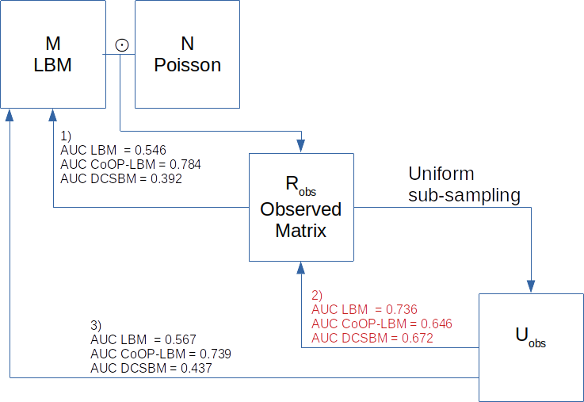

```{r, include = FALSE}
knitr::opts_chunk$set(
  collapse = TRUE,
  comment = "#>"
)
#Validation issue
```

```{r}
library(devtools)
library(pROC)
library(aricode)
library(reshape2)
library(ggplot2)
library(gridExtra)
library(sbm)
library(ggpubr)
library(CoOPLBM)
```

The purpose of this simulation study is to highlight an issue about a common validation process when trying to find missing interactions. A common way to validate if an algorithm is able to find missing interactions is to subsample the interactions matrix, and then try to find the interactions that have been removed. However, this approach assumes that the observed interaction matrix already represents the complete set of interactions. It is possible that the algorithm finds interactions that were already missing in the observed matrix. This would penalized the AUC score because these discoveries would be counted as false positive. 

## Result

We remind in the below graphic that $M$ represents the full interaction matrix and is a bipartite stochastic bloc model, $N$ is the sampling process follows a Poisson distribution $\mathcal{P}(\lambda_i\mu_j G)$, and that we observe $R_{obs} = M \odot N$ the element wise product of $M$ and $N$. We note $V$ the observed support of $R_{obs}$ such as $V_{i,j} = 1\{R_{obs_{i,j}}>0\}$  . Common validation procedure requires to subsample the observed matrix, which gives us a matrix $U_{obs}$ and then trying to find the missing interaction of the observed matrix. 


1) As we can see, on simulated data the CoOP-LBM can retrieve the missing interaction of M using the observed matrix compared to the LBM and the DCSBM. 
2) However, if we do the validation as done usually, by subsampling the observed matrix and trying to find the new missing interactions, we observe that CoOP-LBM has a lower AUC score than the other methods. 
3) The CoOP-LBM would perform better if we made the comparison directly with the full $M$ matrix. This matrix is available when doing simulation, but not in ecological applications, unless the network is very well sampled.  


```{r,echo=FALSE, message=FALSE, results='hide'}
set.seed(1)
n1 = 50
n2 = 50
Q1 = 3
Q2 = 3
Q=Q1
P =matrix(c(0.95,0.6,0.5,
                 0.5,0.2,0.1,
                 0.2,0.1,0.05),Q1,Q2)

alpha1 = c(1/3,1/3,1/3)
alpha2 = c(1/3,1/3,1/3)
simulation1=simulate_lbm(P,alpha1,alpha2,n1,n2)
M = simulation1$A
Z1 =simulation1$Z
Z2 =simulation1$W
G= 50
C1 =rbeta(n1,0.3,1.5)
C2 = rbeta(n2,0.3,1.5)
C1 = C1/max(C1)
C2 = C2/max(C2)

#C1 = runif(n1,min=0.2,max=0.5)
#C2 = runif(n1,min=0.2,max=0.5)
#C1[1]=1
#C2[1]=1


N0=C1%*%t(C2)*G
N=matrix(rpois(n1*n2,N0),nrow=n1)
R = M*N

obsrow = rowSums(R)>0
obscol = colSums(R)>0
R_obs = R[obsrow,obscol]
M_obs = M[obsrow,obscol]
Z1_obs = Z1[obsrow]
Z2_obs = Z2[obscol]
V = 1*(R_obs>0)

```


```{r fit1,cache=TRUE,echo=FALSE, message=FALSE, results='hide'}
try1=fit_unsupervised_LBM(V,exploOptions = list(plot=FALSE,verbosity=F))
try2=fit_unsupervised_CoOP_LBM(R_obs,exploOptions = list(plot=F,verbosity=F))


cov_row = lapply(2:nrow(V),function(k){
    X = matrix(0,nrow(V),ncol(V))
    X[k,] = 1
    X
  })
  cov_col = lapply(2:ncol(V),function(k){
    X = matrix(0,nrow(V),ncol(V))
    X[,k] = 1
    X
  })


try3 = estimateBipartiteSBM(R_obs,model = "poisson",covariates = c(cov_row,cov_col),estimOptions = list(plot=F,verbosity =0 , exploreMax = 10))
model1 = try1[[best_ICL(try1)]]
model2 = try2[[best_ICL(try2)]]
model3 = try3


```


```{r,echo=FALSE, message=FALSE, results='hide'}
proba_connect1 = model1$pi[model1$cluster1,model1$cluster2]
proba_connect2 = model2$connectivity_prob
proba_connect3 = 1-exp(-fitted(model3))
proba_connect3[V==1]=1


AUC_LBM  = auc(roc(M_obs[V==0],proba_connect1[V==0],
                   direction="<",levels=levels(as.factor(c(0,1)))))
AUC_CoOP = auc(roc(M_obs[V==0],proba_connect2[V==0],
                   direction="<",levels=levels(as.factor(c(0,1)))))
AUC_DCSBM = auc(roc(M_obs[V==0],proba_connect3[V==0],
                    direction="<",levels=levels(as.factor(c(0,1)))))


print(paste0("AUC | LBM  = ",round(AUC_LBM,3)," | CoOP-LBM = ",round(AUC_CoOP,3)," | DCSBM = ",round(AUC_DCSBM,3) ))

```


```{r,echo=FALSE, message=FALSE, results='hide'}
U=rbinom(n=length(R_obs),c(R_obs),0.5)
U = matrix(U,nrow=nrow(R_obs))

obsrow2 = rowSums(U)>0
obscol2 = colSums(U)>0
U_obs = U[obsrow2,obscol2]
cov_row = lapply(2:nrow(U_obs),function(k){
    X = matrix(0,nrow(U_obs),ncol(U_obs))
    X[k,] = 1
    X
  })
  cov_col = lapply(2:ncol(U_obs),function(k){
    X = matrix(0,nrow(U_obs),ncol(U_obs))
    X[,k] = 1
    X
  })

R_obs2 = R_obs[obsrow2,obscol2]
M_obs2 = M_obs[obsrow2,obscol2]
V_obs2 = 1*(R_obs2>0)

sum(M_obs2>0)
sum(V_obs2>0)
sum(U_obs>0)

```


```{r fit2,cache=TRUE,echo=FALSE, message=FALSE, results='hide'}
try1=fit_unsupervised_LBM(U_obs,exploOptions = list(plot=FALSE,verbosity=F))
try2=fit_unsupervised_CoOP_LBM(U_obs,exploOptions = list(plot=F,verbosity=F))


try3 = estimateBipartiteSBM(U_obs,model = "poisson",covariates = c(cov_row,cov_col),estimOptions = list(plot=F,verbosity =0 , exploreMax = 10))

model1 = try1[[best_ICL(try1)]]
model2 = try2[[best_ICL(try2)]]
model3 = try3
```

```{r,echo=FALSE, message=FALSE, results='hide'}
proba_connect1 = model1$pi[model1$cluster1,model1$cluster2]
proba_connect2 = model2$connectivity_prob
proba_connect3 = 1-exp(-fitted(model3))

AUC_LBM  = auc(roc(M_obs2[U_obs==0],proba_connect1[U_obs==0],
                   direction="<",levels=levels(as.factor(c(0,1)))))
AUC_CoOP = auc(roc(M_obs2[U_obs==0],proba_connect2[U_obs==0],
                   direction="<",levels=levels(as.factor(c(0,1)))))

AUC_DCSBM = auc(roc(M_obs2[U_obs==0],proba_connect3[U_obs==0],
                   direction="<",levels=levels(as.factor(c(0,1)))))


print(paste0("AUC | LBM  = ",round(AUC_LBM,3)," | CoOP-LBM = ",round(AUC_CoOP,3)," | DCSBM = ",round(AUC_DCSBM,3) ))

```


```{r,echo=FALSE, message=FALSE, results='hide'}

AUC_LBM  = auc(roc(V_obs2[U_obs==0],proba_connect1[U_obs==0],
                   direction="<",levels=levels(as.factor(c(0,1)))))
AUC_CoOP = auc(roc(V_obs2[U_obs==0],proba_connect2[U_obs==0],
                   direction="<",levels=levels(as.factor(c(0,1)))))
AUC_DCSBM  = auc(roc(V_obs2[U_obs==0],proba_connect3[U_obs==0],
                   direction="<",levels=levels(as.factor(c(0,1)))))

print(paste0("AUC | LBM  = ",round(AUC_LBM,3)," | CoOP-LBM = ",round(AUC_CoOP,3)," | DCSBM = ",round(AUC_DCSBM,3) ))

```


---------------------------


```{r,echo=FALSE, message=FALSE}
A=proba_connect1[U_obs==0]
B=M_obs2[U_obs==0]
C=V_obs2[U_obs==0]
orderA = order(A,decreasing=T)


listB1 = c(0)
listC1 = c(0)
listFP1 = c(0)
for (k in 1:length(A)){
  if (B[orderA[k]]==0){
    listB1 = c(listB1,listB1[length(listFP1)])
    listC1 = c(listC1,listC1[length(listFP1)])
    listFP1 = c(listFP1,listFP1[length(listFP1)]+1)
  }
  
  if (B[orderA[k]]==1){  
  if (C[orderA[k]]==0){
    listB1 = c(listB1,listB1[length(listFP1)]+1)
    listC1 = c(listC1,listC1[length(listFP1)])
    listFP1 = c(listFP1,listFP1[length(listFP1)])
  }
    if (C[orderA[k]]==1){
    listB1 = c(listB1,listB1[length(listFP1)])
    listC1 = c(listC1,listC1[length(listFP1)]+1)
    listFP1 = c(listFP1,listFP1[length(listFP1)])
  }}
  
  
}
```


```{r,echo=FALSE, message=FALSE}
A=proba_connect2[U_obs==0]
B=M_obs2[U_obs==0]
C=V_obs2[U_obs==0]
orderA = order(A,decreasing=T)


listB2 = c(0)
listC2 = c(0)
listFP2 = c(0)
for (k in 1:length(A)){
  if (B[orderA[k]]==0){
    listB2 = c(listB2,listB2[length(listFP2)])
    listC2 = c(listC2,listC2[length(listFP2)])
    listFP2 = c(listFP2,listFP2[length(listFP2)]+1)
  }
  
  if (B[orderA[k]]==1){  
  if (C[orderA[k]]==0){
    listB2 = c(listB2,listB2[length(listFP2)]+1)
    listC2 = c(listC2,listC2[length(listFP2)])
    listFP2 = c(listFP2,listFP2[length(listFP2)])
  }
    if (C[orderA[k]]==1){
    listB2 = c(listB2,listB2[length(listFP2)])
    listC2 = c(listC2,listC2[length(listFP2)]+1)
    listFP2 = c(listFP2,listFP2[length(listFP2)])
  }}
  
  
}
```


```{r,echo=FALSE, message=FALSE}
A=proba_connect3[U_obs==0]
B=M_obs2[U_obs==0]
C=V_obs2[U_obs==0]
orderA = order(A,decreasing=T)


listB3 = c(0)
listC3 = c(0)
listFP3 = c(0)
for (k in 1:length(A)){
  if (B[orderA[k]]==0){
    listB3 = c(listB3,listB3[length(listFP3)])
    listC3 = c(listC3,listC3[length(listFP3)])
    listFP3 = c(listFP3,listFP3[length(listFP3)]+1)
  }
  
  if (B[orderA[k]]==1){  
  if (C[orderA[k]]==0){
    listB3 = c(listB3,listB3[length(listFP3)]+1)
    listC3 = c(listC3,listC3[length(listFP3)])
    listFP3 = c(listFP3,listFP3[length(listFP3)])
  }
    if (C[orderA[k]]==1){
    listB3 = c(listB3,listB3[length(listFP3)])
    listC3 = c(listC3,listC3[length(listFP3)]+1)
    listFP3 = c(listFP3,listFP3[length(listFP3)])
  }}
  
  
}
```

In this study there are two kinds of missing interactions : 

1) Interactions in $M$ which are not observed in $R_{obs}$. We remind that $U_{obs}$ is a subsampling of $R_obs$, and therefore, this interaction is also missing in $U_{obs}$,($M_{i,j} = 1 , R_{obs\, i,j}=0, U_{obs\, i,j}=0$).
2) Interactions in $M$ which are observed in $R_{obs}$, but are not observed in the subsampling  ($M_{i,j} = 1 , R_{obs\, i,j}>0, U_{obs\, i,j}=0$).

We fit each method (LBM, CoOP-LBM and DCSBM), and estimate a probability of missing value $\hat{p}_{i,j}$ where $U_{obs}=0$. We order these probabilities in decreasing in order, which would be the order of discoveries, and then we consider the following values :

1) TP M : number of detected values where $M_{i,j}=1$ even tho $R_{obs} = 0 = U_{obs\, i,j}$
2) TP V : number of detected values where $V_{i,j}=1$. 
3) False positives : number of detected values even if $M_{i,j}=0$

```{r,fig.width=7,echo=FALSE}
par(mfrow=c(1,3))
plot(listFP1,type="l",main = "LBM",ylab = "Discoveries")
lines(listB1,col="red")
lines(listC1,col="blue")
legend("topleft",lty=c(1,1,1),col=c("black","red","blue"),legend=c("FP","TP : M","TP : V"))

plot(listFP2,type="l",main = "CoOP-LBM",ylab = "Discoveries")
lines(listB2,col="red")
lines(listC2,col="blue")
legend("topleft",lty=c(1,1,1),col=c("black","red","blue"),legend=c("FP","TP : M","TP : V"))

plot(listFP3,type="l",main = "DCSBM",ylab = "Discoveries")
lines(listB3,col="red")
lines(listC3,col="blue")
legend("topleft",lty=c(1,1,1),col=c("black","red","blue"),legend=c("FP","TP : M","TP : V"))

```

As we can see on the figure above, CoOP-LBM detects more missing interactions coming from the observation process $R_{obs}= M \odot N$ (lign in red) than the one comming from the subsampling $U_{obs}$


```{r,fig.width=7,echo=FALSE}
par(mfrow=c(1,3))

plot(listFP1/max(listFP1),type="l",main = "LBM : ",ylab= "positive rate")
lines(listB1/max(listB1),col="red")
lines(listC1/max(listC1),col="blue")
legend("bottomright",lty=c(1,1,1),col=c("black","red","blue"),legend=c("FP","TP : M","TP : V"))

plot(listFP2/max(listFP2),type="l",main = "CoOP-LBM : ",ylab= "positive rate")
lines(listB2/max(listB2),col="red")
lines(listC2/max(listC2),col="blue")
legend("bottomright",lty=c(1,1,1),col=c("black","red","blue"),legend=c("FP","TP : M","TP : V"))

plot(listFP3/max(listFP3),type="l",main = "DCSBM : ",ylab= "positive rate")
lines(listB3/max(listB3),col="red")
lines(listC3/max(listC3),col="blue")
legend("bottomright",lty=c(1,1,1),col=c("black","red","blue"),legend=c("FP","TP : M","TP : V"))
```

This graphic is the same as the precedent, but each curve have been scaled with the maximum value they reach. Once again, we can see that the LBM and DCSBM will first recover the interactions of $V_{i,j}$ that has gone missing because of the subsampling $U_{obs}$, but they don't find the missing interactions from $M$ that has gone missing because of $R_{obs}$.

```{r,fig.width=7,echo=FALSE}
time0=rep(1:(length(listFP1)-1),3)
value = c(listFP1[-1]/(1:(length(listFP1)-1)),listB1[-1]/(1:(length(listFP1)-1)),listC1[-1]/(1:(length(listFP1)-1)))
group= rep(c("FP","TP : M", "TP : V"),each=length(listFP1)-1)
data1<-data.frame(time0,value,group)
p1=ggplot(data1, aes(x=time0, y=value, fill=group))+
  geom_area()+
  ggtitle("LBM positive rate ")+
  theme( legend.position = "none" )+
  labs(x="Index")
```

```{r,fig.width=7,echo=FALSE}
time0=rep(1:(length(listFP2)-1),3)
value = c(listFP2[-1]/(1:(length(listFP2)-1)),listB2[-1]/(1:(length(listFP2)-1)),listC2[-1]/(1:(length(listFP2)-1)))
group= rep(c("FP","TP : M", "TP : V"),each=length(listFP2)-1)
data1<-data.frame(time0,value,group)
p2=ggplot(data1, aes(x=time0, y=value, fill=group))+
  geom_area()+
  ggtitle("CoOP-LBM positive rate ")+
  theme( legend.position = "none" )  +
  labs(x="Index")
```
```{r,fig.width=7,echo=FALSE}
time0=rep(1:(length(listFP3)-1),3)
value = c(listFP3[-1]/(1:(length(listFP3)-1)),listB3[-1]/(1:(length(listFP3)-1)),listC3[-1]/(1:(length(listFP3)-1)))
group= rep(c("FP","TP : M", "TP : V"),each=length(listFP3)-1)
data1<-data.frame(time0,value,group)
p3=ggplot(data1, aes(x=time0, y=value, fill=group))+
  geom_area()+
  ggtitle("DCSBM positive rate ")+
  theme( legend.position = "none" ) +
  labs(x="Index") 
```

```{r,echo=FALSE,fig.show='hide'}
plot1_legend <- ggplot(data1, aes(x=time0, y=value, fill=group))+
  geom_area()+ggtitle("LBM positive rate ")+
              theme(legend.position = "right") + 
  guides(fill = guide_legend(title = "Discoveries")) 
get_only_legend <- function(plot) { 
  plot_table <- ggplot_gtable(ggplot_build(plot)) 
  legend_plot <- which(sapply(plot_table$grobs, function(x) x$name) == "guide-box") 
  legend <- plot_table$grobs[[legend_plot]] 
  return(legend) 
} 
legend0 <- get_only_legend(plot1_legend)  
combined_plot <- grid.arrange(p1,p2,p3, ncol = 3) 
```

```{r,fig.width = 9,fig.height=3,echo=FALSE, message=FALSE}
grid.arrange(combined_plot, legend0, nrow = 1, widths= c(10, 1))
```
This figure shows why the LBM and DCSBM has better score when we try to calculate the AUC with $V_{i,j}$ instead of $M_{i,j}$. For the LBM and the DCSBM, The majority of first discovered interactions are the one that went missing because of the subsampling of $R_{obs}$ (area in blue). Meanwhile, the CoOP-LBM detects first the interaction comming from $M$ (area in green). We reach the same conclusion using the graph below.


```{r,fig.width = 9,fig.height=3,echo=FALSE, message=FALSE}
par(mfrow=c(1,3))
plot(listFP1,type="l",main= "false positive",ylab = "number of discoveries")
lines(listFP2,lty=2)
lines(listFP3,lty=3)
legend("topleft",lty=c(1,2,3),legend=c("LBM","CoOP-LBM","DCSBM"))

plot(listB1,type="l",main= "true positive for missing M interaction",ylab = "number of discoveries")
lines(listB2,lty=2)
lines(listB3,lty=3)
#legend("topleft",lty=c(1,2,3),legend=c("LBM","CoOP-LBM","DCSBM"))

plot(listC1,type="l",main= "true positive for missing V interaction",ylab = "number of discoveries")
lines(listC2,lty=2)
lines(listC3,lty=3)
#legend("topleft",lty=c(1,2,3),legend=c("LBM","CoOP-LBM","DCSBM"))

```


```{r,echo=FALSE, message=FALSE,fig.width = 5,fig.height=5}
plot(listB1+listC1,type="l",main="true positive (all)")
lines(listB2+listC2,lty=2)
lines(listB3+listC3,lty=3)
legend("topleft",lty=c(1,2,3),legend=c("LBM","CoOP-LBM","DCSBM"))

```

If we reunite all the postive values ($TP V  + TP M$), then CoOP-LBM performs better than LBM and DCSBM. However in many cases, we only have access to $TP V$, which in our case, disadvantages the CoOP-LBM.

All the code needed to replicate these results are available below.

## Code


```{r}
set.seed(1)
n1 = 50
n2 = 50
Q1 = 3
Q2 = 3
Q=Q1
P =matrix(c(0.95,0.6,0.5,
                 0.5,0.2,0.1,
                 0.2,0.1,0.05),Q1,Q2)

alpha1 = c(1/3,1/3,1/3)
alpha2 = c(1/3,1/3,1/3)
simulation1=simulate_lbm(P,alpha1,alpha2,n1,n2)
M = simulation1$A
Z1 =simulation1$Z
Z2 =simulation1$W
G= 50
C1 =rbeta(n1,0.3,1.5)
C2 = rbeta(n2,0.3,1.5)
C1 = C1/max(C1)
C2 = C2/max(C2)

#C1 = runif(n1,min=0.2,max=0.5)
#C2 = runif(n1,min=0.2,max=0.5)
#C1[1]=1
#C2[1]=1


N0=C1%*%t(C2)*G
N=matrix(rpois(n1*n2,N0),nrow=n1)
R = M*N

obsrow = rowSums(R)>0
obscol = colSums(R)>0
R_obs = R[obsrow,obscol]
M_obs = M[obsrow,obscol]
Z1_obs = Z1[obsrow]
Z2_obs = Z2[obscol]
V = 1*(R_obs>0)

```


```{r fit3,cache=TRUE}
try1=fit_unsupervised_LBM(V,exploOptions = list(plot=FALSE,verbosity=F))
try2=fit_unsupervised_CoOP_LBM(R_obs,exploOptions = list(plot=F,verbosity=F))


cov_row = lapply(2:nrow(V),function(k){
    X = matrix(0,nrow(V),ncol(V))
    X[k,] = 1
    X
  })
  cov_col = lapply(2:ncol(V),function(k){
    X = matrix(0,nrow(V),ncol(V))
    X[,k] = 1
    X
  })


try3 = estimateBipartiteSBM(R_obs,model = "poisson",covariates = c(cov_row,cov_col),estimOptions = list(plot=F,verbosity =0 , exploreMax = 10))
model1 = try1[[best_ICL(try1)]]
model2 = try2[[best_ICL(try2)]]
model3 = try3


```


```{r}
proba_connect1 = model1$pi[model1$cluster1,model1$cluster2]
proba_connect2 = model2$connectivity_prob
proba_connect3 = 1-exp(-fitted(model3))
proba_connect3[V==1]=1


AUC_LBM  = auc(roc(M_obs[V==0],proba_connect1[V==0],
                   direction="<",levels=levels(as.factor(c(0,1)))))
AUC_CoOP = auc(roc(M_obs[V==0],proba_connect2[V==0],
                   direction="<",levels=levels(as.factor(c(0,1)))))
AUC_DCSBM = auc(roc(M_obs[V==0],proba_connect3[V==0],
                    direction="<",levels=levels(as.factor(c(0,1)))))


print(paste0("AUC | LBM  = ",round(AUC_LBM,3)," | CoOP-LBM = ",round(AUC_CoOP,3)," | DCSBM = ",round(AUC_DCSBM,3) ))

```


```{r}
U=rbinom(n=length(R_obs),c(R_obs),0.5)
U = matrix(U,nrow=nrow(R_obs))

obsrow2 = rowSums(U)>0
obscol2 = colSums(U)>0
U_obs = U[obsrow2,obscol2]
cov_row = lapply(2:nrow(U_obs),function(k){
    X = matrix(0,nrow(U_obs),ncol(U_obs))
    X[k,] = 1
    X
  })
  cov_col = lapply(2:ncol(U_obs),function(k){
    X = matrix(0,nrow(U_obs),ncol(U_obs))
    X[,k] = 1
    X
  })

R_obs2 = R_obs[obsrow2,obscol2]
M_obs2 = M_obs[obsrow2,obscol2]
V_obs2 = 1*(R_obs2>0)

sum(M_obs2>0)
sum(V_obs2>0)
sum(U_obs>0)

```


```{r fit4,cache=TRUE}
try1=fit_unsupervised_LBM(U_obs,exploOptions = list(plot=FALSE,verbosity=F))
try2=fit_unsupervised_CoOP_LBM(U_obs,exploOptions = list(plot=F,verbosity=F))


try3 = estimateBipartiteSBM(U_obs,model = "poisson",covariates = c(cov_row,cov_col),estimOptions = list(plot=F,verbosity =0 , exploreMax = 10))

model1 = try1[[best_ICL(try1)]]
model2 = try2[[best_ICL(try2)]]
model3 = try3
```

```{r}
proba_connect1 = model1$pi[model1$cluster1,model1$cluster2]
proba_connect2 = model2$connectivity_prob
proba_connect3 = 1-exp(-fitted(model3))

AUC_LBM  = auc(roc(M_obs2[U_obs==0],proba_connect1[U_obs==0],
                   direction="<",levels=levels(as.factor(c(0,1)))))
AUC_CoOP = auc(roc(M_obs2[U_obs==0],proba_connect2[U_obs==0],
                   direction="<",levels=levels(as.factor(c(0,1)))))

AUC_DCSBM = auc(roc(M_obs2[U_obs==0],proba_connect3[U_obs==0],
                   direction="<",levels=levels(as.factor(c(0,1)))))


print(paste0("AUC | LBM  = ",round(AUC_LBM,3)," | CoOP-LBM = ",round(AUC_CoOP,3)," | DCSBM = ",round(AUC_DCSBM,3) ))

```


```{r}

AUC_LBM  = auc(roc(V_obs2[U_obs==0],proba_connect1[U_obs==0],
                   direction="<",levels=levels(as.factor(c(0,1)))))
AUC_CoOP = auc(roc(V_obs2[U_obs==0],proba_connect2[U_obs==0],
                   direction="<",levels=levels(as.factor(c(0,1)))))
AUC_DCSBM  = auc(roc(V_obs2[U_obs==0],proba_connect3[U_obs==0],
                   direction="<",levels=levels(as.factor(c(0,1)))))

print(paste0("AUC | LBM  = ",round(AUC_LBM,3)," | CoOP-LBM = ",round(AUC_CoOP,3)," | DCSBM = ",round(AUC_DCSBM,3) ))

```


---------------------------


```{r}
A=proba_connect1[U_obs==0]
B=M_obs2[U_obs==0]
C=V_obs2[U_obs==0]
orderA = order(A,decreasing=T)


listB1 = c(0)
listC1 = c(0)
listFP1 = c(0)
for (k in 1:length(A)){
  if (B[orderA[k]]==0){
    listB1 = c(listB1,listB1[length(listFP1)])
    listC1 = c(listC1,listC1[length(listFP1)])
    listFP1 = c(listFP1,listFP1[length(listFP1)]+1)
  }
  
  if (B[orderA[k]]==1){  
  if (C[orderA[k]]==0){
    listB1 = c(listB1,listB1[length(listFP1)]+1)
    listC1 = c(listC1,listC1[length(listFP1)])
    listFP1 = c(listFP1,listFP1[length(listFP1)])
  }
    if (C[orderA[k]]==1){
    listB1 = c(listB1,listB1[length(listFP1)])
    listC1 = c(listC1,listC1[length(listFP1)]+1)
    listFP1 = c(listFP1,listFP1[length(listFP1)])
  }}
  
  
}
```


```{r}
A=proba_connect2[U_obs==0]
B=M_obs2[U_obs==0]
C=V_obs2[U_obs==0]
orderA = order(A,decreasing=T)


listB2 = c(0)
listC2 = c(0)
listFP2 = c(0)
for (k in 1:length(A)){
  if (B[orderA[k]]==0){
    listB2 = c(listB2,listB2[length(listFP2)])
    listC2 = c(listC2,listC2[length(listFP2)])
    listFP2 = c(listFP2,listFP2[length(listFP2)]+1)
  }
  
  if (B[orderA[k]]==1){  
  if (C[orderA[k]]==0){
    listB2 = c(listB2,listB2[length(listFP2)]+1)
    listC2 = c(listC2,listC2[length(listFP2)])
    listFP2 = c(listFP2,listFP2[length(listFP2)])
  }
    if (C[orderA[k]]==1){
    listB2 = c(listB2,listB2[length(listFP2)])
    listC2 = c(listC2,listC2[length(listFP2)]+1)
    listFP2 = c(listFP2,listFP2[length(listFP2)])
  }}
  
  
}
```


```{r}
A=proba_connect3[U_obs==0]
B=M_obs2[U_obs==0]
C=V_obs2[U_obs==0]
orderA = order(A,decreasing=T)


listB3 = c(0)
listC3 = c(0)
listFP3 = c(0)
for (k in 1:length(A)){
  if (B[orderA[k]]==0){
    listB3 = c(listB3,listB3[length(listFP3)])
    listC3 = c(listC3,listC3[length(listFP3)])
    listFP3 = c(listFP3,listFP3[length(listFP3)]+1)
  }
  
  if (B[orderA[k]]==1){  
  if (C[orderA[k]]==0){
    listB3 = c(listB3,listB3[length(listFP3)]+1)
    listC3 = c(listC3,listC3[length(listFP3)])
    listFP3 = c(listFP3,listFP3[length(listFP3)])
  }
    if (C[orderA[k]]==1){
    listB3 = c(listB3,listB3[length(listFP3)])
    listC3 = c(listC3,listC3[length(listFP3)]+1)
    listFP3 = c(listFP3,listFP3[length(listFP3)])
  }}
  
  
}
```

In this study there are two kinds of missing interactions : 

1) Interactions in $M$ which are not observed in $R_{obs}$. We remind that $U_{obs}$ is a subsampling of $R_obs$, and therefore, this interaction is also missing in $U_{obs}$,($M_{i,j} = 1 , R_{obs\, i,j}=0, U_{obs\, i,j}=0$).
2) Interactions in $M$ which are observed in $R_{obs}$, but are not observed in the subsampling  ($M_{i,j} = 1 , R_{obs\, i,j}>0, U_{obs\, i,j}=0$).

We fit each method (LBM, CoOP-LBM and DCSBM), and estimate a probability of missing value $\hat{p}_{i,j}}$ where $U_{obs}=0$. We order these probabilities in decreasing in order, which would be the order of discoveries, and then we consider the following values :

1) TP M : number of detected values where $M_{i,j}=1$ even tho $R_{obs} = 0 = U_{obs\, i,j}$
2) TP V : number of detected values where $V_{i,j}=1$. 
3) False positives : number of detected values even if $M_{i,j}=0$

```{r,fig.width=7}
par(mfrow=c(1,3))
plot(listFP1,type="l",main = "LBM",ylab = "Discoveries")
lines(listB1,col="red")
lines(listC1,col="blue")
legend("topleft",lty=c(1,1,1),col=c("black","red","blue"),legend=c("FP","TP : M","TP : V"))

plot(listFP2,type="l",main = "CoOP-LBM",ylab = "Discoveries")
lines(listB2,col="red")
lines(listC2,col="blue")
legend("topleft",lty=c(1,1,1),col=c("black","red","blue"),legend=c("FP","TP : M","TP : V"))

plot(listFP3,type="l",main = "DCSBM",ylab = "Discoveries")
lines(listB3,col="red")
lines(listC3,col="blue")
legend("topleft",lty=c(1,1,1),col=c("black","red","blue"),legend=c("FP","TP : M","TP : V"))

```

As we can see on the figure above, CoOP-LBM detects more missing interactions coming from the observation process $R_{obs}= M \odot N$ (lign in red) than the one comming from the subsampling $U_{obs}$


```{r,fig.width=7}
par(mfrow=c(1,3))

plot(listFP1/max(listFP1),type="l",main = "LBM : ",ylab= "positive rate")
lines(listB1/max(listB1),col="red")
lines(listC1/max(listC1),col="blue")
legend("bottomright",lty=c(1,1,1),col=c("black","red","blue"),legend=c("FP","TP : M","TP : V"))

plot(listFP2/max(listFP2),type="l",main = "CoOP-LBM : ",ylab= "positive rate")
lines(listB2/max(listB2),col="red")
lines(listC2/max(listC2),col="blue")
legend("bottomright",lty=c(1,1,1),col=c("black","red","blue"),legend=c("FP","TP : M","TP : V"))

plot(listFP3/max(listFP3),type="l",main = "DCSBM : ",ylab= "positive rate")
lines(listB3/max(listB3),col="red")
lines(listC3/max(listC3),col="blue")
legend("bottomright",lty=c(1,1,1),col=c("black","red","blue"),legend=c("FP","TP : M","TP : V"))
```

This graphic is the same as the precedent, but each curve have been scaled with the maximum value they reach. Once again, we can see that the LBM and DCSBM will first recover the interactions of $V_{i,j}$ that has gone missing because of the subsampling $U_{obs}$, but they don't find the missing interactions from $M$ that has gone missing because of $R_{obs}$.

```{r,fig.width=7}
time0=rep(1:(length(listFP1)-1),3)
value = c(listFP1[-1]/(1:(length(listFP1)-1)),listB1[-1]/(1:(length(listFP1)-1)),listC1[-1]/(1:(length(listFP1)-1)))
group= rep(c("FP","TP : M", "TP : V"),each=length(listFP1)-1)
data1<-data.frame(time0,value,group)
p1=ggplot(data1, aes(x=time0, y=value, fill=group))+
  geom_area()+
  ggtitle("LBM positive rate ")+
  theme( legend.position = "none" )+
  labs(x="Index")
```

```{r,fig.width=7}
time0=rep(1:(length(listFP2)-1),3)
value = c(listFP2[-1]/(1:(length(listFP2)-1)),listB2[-1]/(1:(length(listFP2)-1)),listC2[-1]/(1:(length(listFP2)-1)))
group= rep(c("FP","TP : M", "TP : V"),each=length(listFP2)-1)
data1<-data.frame(time0,value,group)
p2=ggplot(data1, aes(x=time0, y=value, fill=group))+
  geom_area()+
  ggtitle("CoOP-LBM positive rate ")+
  theme( legend.position = "none" )  +
  labs(x="Index")
```
```{r,fig.width=7}
time0=rep(1:(length(listFP3)-1),3)
value = c(listFP3[-1]/(1:(length(listFP3)-1)),listB3[-1]/(1:(length(listFP3)-1)),listC3[-1]/(1:(length(listFP3)-1)))
group= rep(c("FP","TP : M", "TP : V"),each=length(listFP3)-1)
data1<-data.frame(time0,value,group)
p3=ggplot(data1, aes(x=time0, y=value, fill=group))+
  geom_area()+
  ggtitle("DCSBM positive rate ")+
  theme( legend.position = "none" ) +
  labs(x="Index") 
```

```{r,fig.show='hide'}
plot1_legend <- ggplot(data1, aes(x=time0, y=value, fill=group))+
  geom_area()+ggtitle("LBM positive rate ")+
              theme(legend.position = "right") + 
  guides(fill = guide_legend(title = "Discoveries")) 
get_only_legend <- function(plot) { 
  plot_table <- ggplot_gtable(ggplot_build(plot)) 
  legend_plot <- which(sapply(plot_table$grobs, function(x) x$name) == "guide-box") 
  legend <- plot_table$grobs[[legend_plot]] 
  return(legend) 
} 
legend0 <- get_only_legend(plot1_legend)  
combined_plot <- grid.arrange(p1,p2,p3, ncol = 3) 
```

```{r,fig.width = 9,fig.height=3}
grid.arrange(combined_plot, legend0, nrow = 1, widths= c(10, 1))
```
This figure shows why the LBM and DCSBM has better score when we try to calculate the AUC with $V_{i,j}$ instead of $M_{i,j}$. For the LBM and the DCSBM, The majority of first discovered interactions are the one that went missing because of the subsampling of $R_{obs}$ (area in blue). Meanwhile, the CoOP-LBM detects first the interaction comming from $M$ (area in green). We reach the same conclusion using the graph below.


```{r,fig.width = 9,fig.height=3}
par(mfrow=c(1,3))
plot(listFP1,type="l",main= "false positive",ylab = "number of discoveries")
lines(listFP2,lty=2)
lines(listFP3,lty=3)
legend("topleft",lty=c(1,2,3),legend=c("LBM","CoOP-LBM","DCSBM"))

plot(listB1,type="l",main= "true positive for missing M interaction",ylab = "number of discoveries")
lines(listB2,lty=2)
lines(listB3,lty=3)
#legend("topleft",lty=c(1,2,3),legend=c("LBM","CoOP-LBM","DCSBM"))

plot(listC1,type="l",main= "true positive for missing V interaction",ylab = "number of discoveries")
lines(listC2,lty=2)
lines(listC3,lty=3)
#legend("topleft",lty=c(1,2,3),legend=c("LBM","CoOP-LBM","DCSBM"))

```


```{r,fig.width = 5,fig.height=5}
plot(listB1+listC1,type="l",main="true positive (all)")
lines(listB2+listC2,lty=2)
lines(listB3+listC3,lty=3)
legend("topleft",lty=c(1,2,3),legend=c("LBM","CoOP-LBM","DCSBM"))

```

If we reunite all the postive values (TP V  + TP M), then CoOP-LBM performs better than LBM and DCSBM. However in many cases, we only have access to TP V, which in our case, disadvantages the CoOP-LBM.


